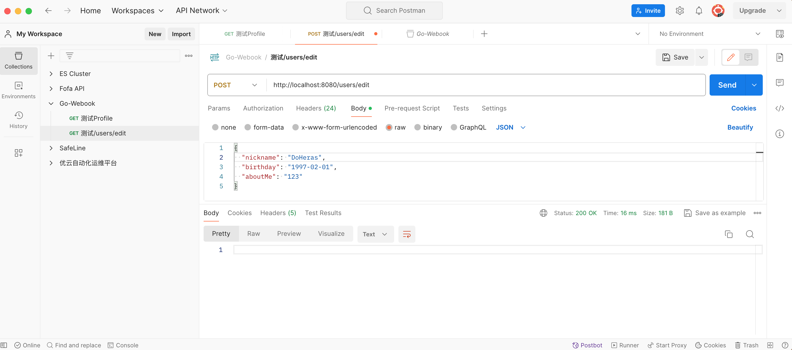

# Week2作业说明

## 1. 实现函数说明

### 1.1 实现Edit接口

- 定义`user.go` 函数中的`Edit`函数，参考路径：`webhook/internal/web/user.go`

  ```go
  func (h *UserHandler) Edit(ctx *gin.Context) {
  	type EditStruct struct {
  		NickName string `json:"nickname"`
  		Birthday string `json:"birthday" `
  		AboutMe  string `json:"aboutMe"`
  	}
  	var editreq EditStruct
  	if err := ctx.Bind(&editreq); err != nil {
  		ctx.String(http.StatusOK, "服务器内部错误请稍后重试")
  		return
  	}
  	// Check NickName Field Input Length
  	if len(editreq.NickName) > 15 {
  		ctx.String(http.StatusOK, "昵称字段超出限制")
  		return
  	}
  	// Check Birthday Field Input Format
  	birthdayConverted, err := time.Parse(time.DateOnly, editreq.Birthday)
  	if err != nil {
  		ctx.String(http.StatusOK, "请检查输入Birthday格式，日期格式错误")
  		return
  	}
  	// Check AboutMe Filed Input Length
  	if len(editreq.AboutMe) > 100 {
  		ctx.String(http.StatusOK, "介绍字段超出限制")
  		return
  	}
  	// Obtain Session ID
  	sess := sessions.Default(ctx)
  	userID, ok := sess.Get("userId").(int64) // Type Int64 Assertion
  	if !ok {
  		ctx.String(http.StatusOK, "服务器内部错误请稍后重试")
  		return
  	}
  	err = h.svc.Edit(ctx, userID, editreq.NickName, birthdayConverted, editreq.AboutMe)
  	if err != nil {
  		ctx.String(http.StatusOK, "服务器内部错误请稍后重试")
  		return
  	}
  }
  ```

- 定义`Edit` 函数 `Service` 层，代码路径：`webhook/internal/service/user.go`

  ```go
  func (svc *UserService) Edit(ctx *gin.Context, userID int64, nickname string, birthday time.Time, aboutme string) error {
  	err := svc.repo.ModifyProfile(ctx, domain.UserProfile{
  		ID:       userID,
  		Nickname: nickname,
  		Birthday: birthday,
  		AboutMe:  aboutme,
  	})
  	if err != nil {
  		return err
  	}
  	return err
  ```

- 定义`ModifyProfile` 的 `repository` 层， 代码路径： `webhook/internal/repository/user.go`

  ```go
  func (repo *UserRepository) ModifyProfile(ctx context.Context, u domain.UserProfile) error {
  	birthdayUnixMilli := u.Birthday.UnixMilli()
  	return repo.dao.ModifyProfile(ctx, dao.UserProfile{
  		ID:       u.ID,
  		Nickname: u.Nickname,
  		Birthday: birthdayUnixMilli,
  		AboutMe:  u.AboutMe,
  	})
  }

- 定义`ModifyProfile` 的 `dao` 层，代码路径: `webhook/internal/repository/dao/user.go`

  ```go
  type UserProfile struct {
  	ID       int64 `gorm:"primaryKey"`
  	Nickname string
  	Birthday int64
  	AboutMe  string
  }
  func (dao *UserDAO) ModifyProfile(ctx context.Context, up UserProfile) error {
  	// Put Data Into DataBase
  	err := dao.db.WithContext(ctx).Save(&up).Error
  	if err != nil {
  		return err
  	}
  	return err
  }
  ```

- 定义`domain.userProfile` 结构体数据结构，代码路径：`webhook/internal/domain/user.go`

  ```go
  type UserProfile struct {
  	ID       int64
  	Nickname string
  	Birthday time.Time
  	AboutMe  string
  }
  ```

### 1.2 实现Profile接口并返回Json数据格式

- 定义Gin框架中`user.go`文件中的Profile函数，参考路径：`webhook/internal/web/user.go`

  ```go
  func (h *UserHandler) Profile(ctx *gin.Context) {
  	// Obtain User ID
  	sess := sessions.Default(ctx)
  	userID, ok := sess.Get("userId").(int64)
  	if !ok {
  		ctx.String(http.StatusOK, "服务器内部错误请稍后重试")
  		return
  	}
  	// Declare New Return
  	rawUserProfile, err := h.svc.Profile(ctx, userID)
  	// Handle With Not Found UserID
  	if errors.Is(err, service.ErrUserProfileNotFound) {
  		ctx.String(http.StatusOK, "未找到该用户信息，请重新初始化")
  	}
  	if err != nil {
  		ctx.String(http.StatusOK, "服务器内部错误请稍后重试")
  		return
  	}
  	type returnUserProfile struct {
  		NickName string
  		Birthday time.Time
  		AboutMe  string
  	}
  	ctx.JSON(http.StatusOK, returnUserProfile{
  		NickName: rawUserProfile.Nickname,
  		Birthday: rawUserProfile.Birthday,
  		AboutMe:  rawUserProfile.AboutMe,
  	})
  }
  ```

- 定义 `service` 层 `Profile` 函数， 代码路径：`webhook/internal/service/user.go`

  ```go
  func (svc *UserService) Profile(ctx *gin.Context, userId int64) (domain.UserProfile, error) {
  	domainUserProfile, err := svc.repo.FindByUserID(ctx, userId)
  	return domainUserProfile, err
  }
  ```

- 定义 `repository` 层的 `FindByUserID` 函数，并重写中间层的数据结构转换；

  ```go
  func (repo *UserRepository) FindByUserID(ctx context.Context, userID int64) (domain.UserProfile, error) {
  	daoUserProfile, err := repo.dao.FindByUserID(ctx, userID)
  	if err != nil {
  		return domain.UserProfile{}, err
  	}
  	return repo.profileToDomain(daoUserProfile), err
  }
  
  func (repo *UserRepository) profileToDomain(profile dao.UserProfile) domain.UserProfile {
  	return domain.UserProfile{
  		Nickname: profile.Nickname,
  		Birthday: time.Unix(profile.Birthday/1000, (profile.Birthday%1000)*1000000),
  		AboutMe:  profile.AboutMe,
  	}
  }
  ```

- 定义`dao` 层直接操作数据库进行查询的`FindByUserID` 函数。

  ```go
  func (dao *UserDAO) FindByUserID(ctx context.Context, userID int64) (UserProfile, error) {
  	var userProfile UserProfile
  	err := dao.db.WithContext(ctx).Where("ID=?", userID).First(&userProfile).Error
  	if errors.Is(err, ErrRecordNotFound) {
  		return UserProfile{}, err
  	}
  	return userProfile, err
  }
  ```

## 2. 实验结果

- 1. 测试能够创建新的用户Profile数据，使用 `/users/edit` 接口

  

- 2. 检查数据是否能够写入数据库成功，写入格式能够匹配

  

- 3. 重新修改Nickname为其他值，检查能否覆盖原值进行修改

  

- 4. 检查数据库数据成功修改

  

- 5. 查询数据接口： `/users/profile`

  
