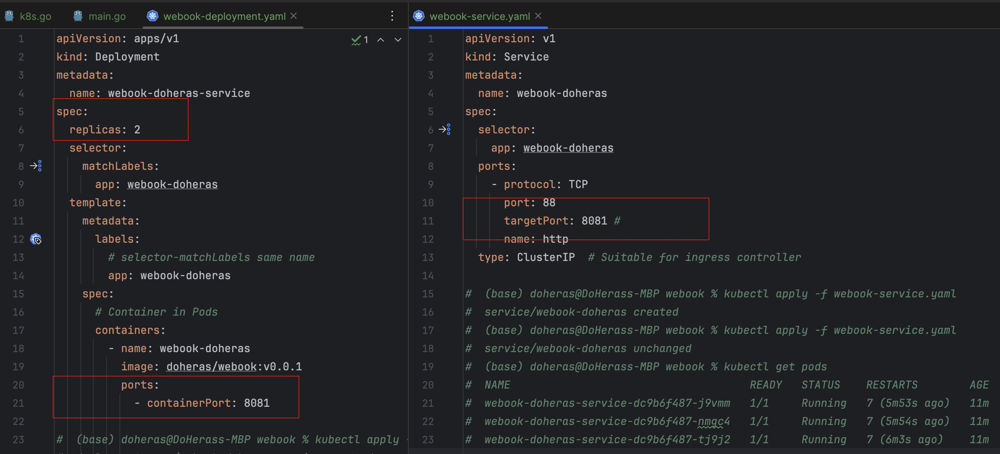

# Week3作业说明

## 1. 环境准备

### 1. 删除所有的Deployment


## 2. 将 webook 的端口更改为8081

- 修改原始代码 - `config.types.go` 新增结构体 `GinConfig`

  

- 修改 `k8s.go`  和  `dev.go` 两个配置文件

  

- 更改 `main.go`

  

- 修改webook的Web服务Kubernetes - `deployment` / `service` 将所有的端口更改，并修改为两个`replicas` 

  

---

## 3. 修改Redis端口为6380

- 修改 `config.k8s.go` 的 redis 连接

  

- 修改 `webook-redis-deployment.yaml`  以及  `webook-redis-service.yaml`

  

---

## 4. MySQL 修改端口为3308


---

## 5. 运行截图

- 运行获得所有`pods`的运行状态


- 运行所有`services`并获得


- 可以能够自由注册

  

---

## 6. 思考题  - 修改MySQL的默认端口

- 修改MySQL配置文件`mysql-deployment.yaml ` / `mysql-service.yaml` 中的 `containerPort` / `targetPort` 需要重新定制`MySQL`Docker镜像；

- 创建 `my.cnf`

  ```
  [mysqld]
  user=mysql
  pid-file=/var/run/mysqld/mysqld.pid
  socket=/var/run/mysqld/mysqld.sock
  port=3308
  datadir=/var/lib/mysql
  ```

- 创建 - `Dockerfile`

  ```dockerfile
  FROM mysql:8.0
  COPY my.cnf /etc/mysql/conf.d/
  EXPOSE 3308
  ```

- 打包新的镜像

  ```
  docker build -t doheras/mysql:8.0-customport .
  ```

- 引用新的镜像并修改配置文件

  


